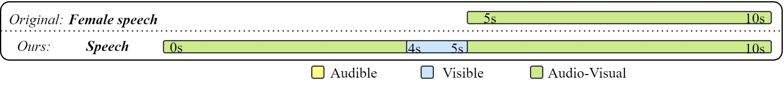
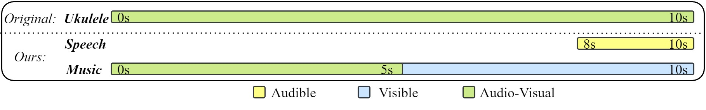

## Welcome to Navigating AudioVisual Event Detection Across Modalities

**DEMOs are here!**

### Parsing result from VEBA test set: 
> These are videos chosen from our VEBA dataset, the parsing result from our model is presented below each video.

#### Case 1:

### A Revise on original labels from AVE dataset: 
> These are videos chosen from the AVE dataset, where the annotated events are all audio-visual. We put a comparison between our parsing result and the original labels to demonstrate the potential of our model in refining previous audio-visual labels.

#### Case 1:

<video width="480" height="270" controls>
    <source src="src/multimodal/AVE/0lFf-HP86Q0.mp4" type="video/mp4">
</video>

#### Case 2:

<video width="480" height="270" controls>
    <source src="src/multimodal/AVE/16eUxQwxxbs.mp4" type="video/mp4">
</video>

#### Case 3:

<video width="480" height="270" controls>
    <source src="src/multimodal/AVE/22olCB3wQaA.mp4" type="video/mp4">
</video>

##### Original:

<embed width="500" height="80" src="src/multimodal/AVE/22olCB3wQaA_ori.pdf"></embed>

### Parsing events for in-the-wild videos: 
