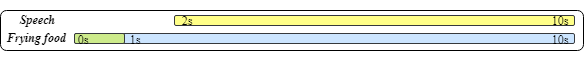
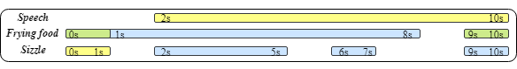

## Welcome to Navigating Audio-Visual Event Detection Across Mismatched Modalities

**DEMOs are here!**

> We use our model to separately parse the event of three modalities: Audio, Visual and Audio-Visual. Audio-Visual means an event happens simultaneously in audio and video.
> Our model predicts the onset(s) and offset(s) of each event. Here yellow represents audio, blue indicates video and green (blue+yellow) means audio-visual, same as the paper.
> The cutline is as follows:

### Parsing result from VEBA test set: 
> These are videos chosen from our VEBA dataset (test set), the parsing result from our model is presented below each video.
> We annotate the onset and offset for all of the videos in our VEBA test set for performance evaluation.
> Here, for each case, we list the ground truth (annotation from VEBA) along with the real parsing output from our model below.

#### Case 1:

<video width="480" height="270" controls>
    <source src="src/multimodal/VEBA/1HNGJDppKG0_60.000_70.000.mp4" type="video/mp4">
</video>

##### Groud Truth:

##### Ours:

#### Case 2:

<video width="480" height="270" controls>
    <source src="src/multimodal/VEBA/-2RPPODqLy4_30.000_40.000.mp4" type="video/mp4">
</video>

##### Groud Truth:

##### Ours:

#### Case 3:

<video width="480" height="270" controls>
    <source src="src/multimodal/VEBA/Am5GHLnpl44_30.000_40.000.mp4" type="video/mp4">
</video>

##### Groud Truth:

##### Ours:

### A Revise on original labels from AVE dataset: 
> These are videos chosen from the AVE dataset, where the annotated events are all audio-visual. 
> We put a comparison between our parsing result and the original labels to demonstrate the potential of our model in refining previous audio-visual labels.

#### Case 1:

<video width="480" height="270" controls>
    <source src="src/multimodal/AVE/0lFf-HP86Q0.mp4" type="video/mp4">
</video>

##### Original:

##### Ours: 

#### Case 2:

<video width="480" height="270" controls>
    <source src="src/multimodal/AVE/16eUxQwxxbs.mp4" type="video/mp4">
</video>

##### Original:

##### Ours: 

#### Case 3:

<video width="480" height="270" controls>
    <source src="src/multimodal/AVE/22olCB3wQaA.mp4" type="video/mp4">
</video>

##### Original:

##### Ours:

